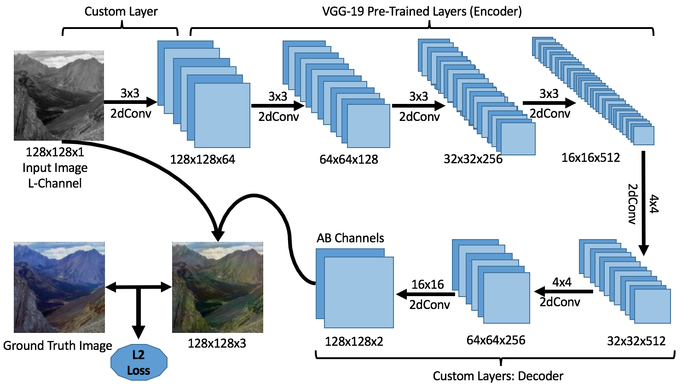
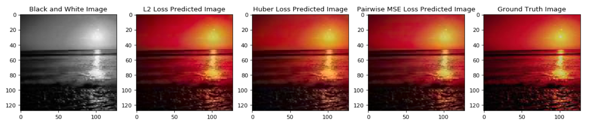
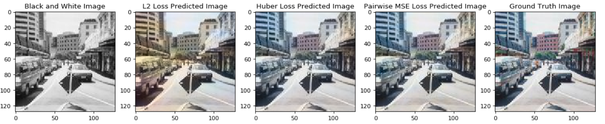
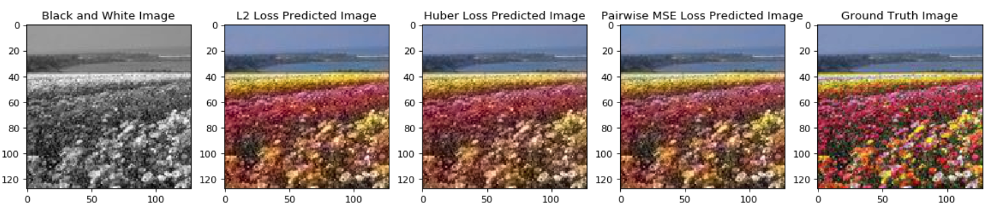
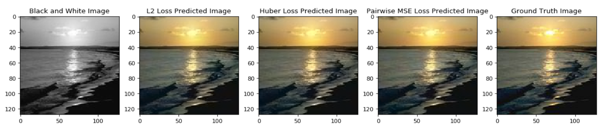
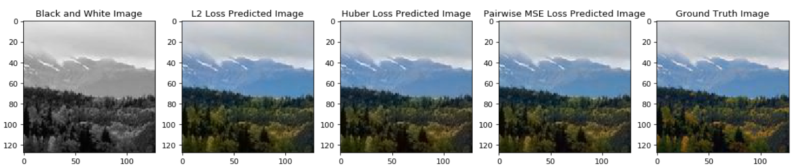
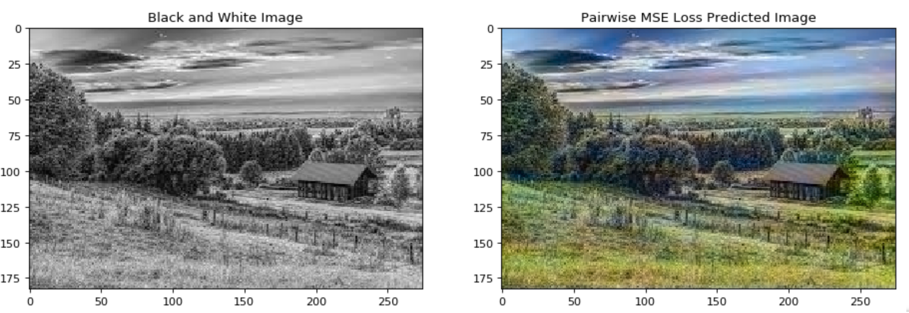
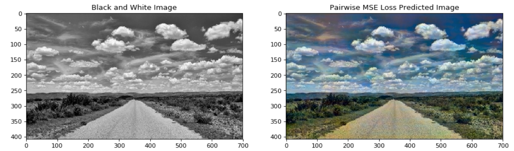
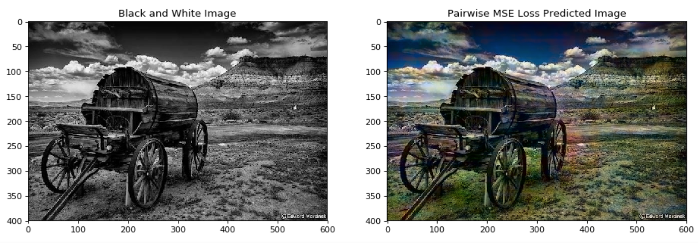

# ImageColorizer

## Abstract

In this paper we detail the building and training of a cross-channel autoencoder capable of coloring black and white photographs. An important distinction is that our network is optimized not to recover the ground-truth colorization of the image, but rather to output a plausible colorization of the image. Many previous studies have attempted to find the ‘best’ or ‘averaged’ output of the network, but often this leads to heavily de-saturated images. This de-saturation is a result of using specific loss functions that encourage conservative color predictions in order to minimize color variance. Thus, we will compare and contrast three fully trained models each with a unique loss function specifically tailored to output brighter and thus more realistic colors. Several of the other key challenges included selecting a color-space representation, pre-processing the images, designing a network architecture, and evaluating our results. Finally, rather than training a complex network on a very large collection of images of various different categories, we instead focussed on creating a smaller network that trains only on a subset of images for which we are trying to colorize (landscapes, portraits, animals, etc). This optimized the results of our network as well as decreased the computational complexity of training and testing the network. If we are trying to colorize old landscape photos, there is no reason that we should be feeding it unrelated and extraneous photos as training inputs. Instead of training a large network to poorly color every possible image, we have created a framework to train a highly specialized network for a specific category of images.

## Architecture

## Training Set Results

## Results on Original Black And White Images

